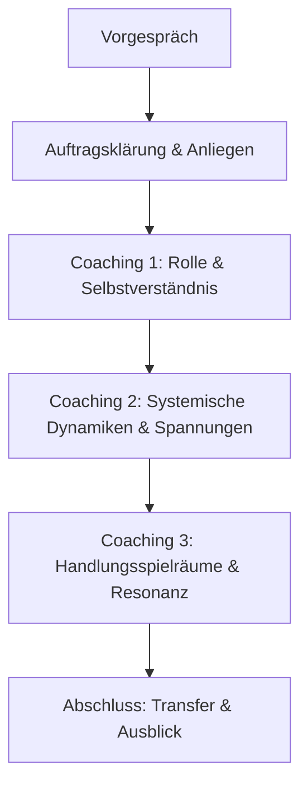

------
title: "Leitfaden: Coaching für Führung & Verantwortung"
slug: leitfaden-coaching-fuehrung
tags: [leitfaden, coaching, führung, systemisch]
created: 2025-06-25
aliases: ["Coaching für Führung", "Führungscoaching", "Führung & Verantwortung"]
draft: false
---

## 🧭 Praxis-Leitfaden  
### Coaching für Führung & Verantwortung  
*Version 1.0 – für Lern- und Entwicklungseinsatz*

---

### 1. Ziel des Angebots (für Klient:innen)

Dieses Coaching unterstützt Führungskräfte bei der Klärung ihrer Rolle, ihrer Verantwortung und ihres Führungsverständnisses.  
Typische Anlässe sind neue Aufgaben, Spannungen im Team oder der Wunsch nach persönlicher Weiterentwicklung. Ziel ist es, in Führung zu gehen – mit Klarheit, Präsenz und systemischer Weitsicht.

---

### 2. Erforderliche Kompetenzen & Haltungen (für dich als Coach)

**Haltung:**
- professionell distanziert, allparteilich, systemisch denkend  
- sensibel für Macht, Verantwortung, Projektion  
- Raumgeber:in für Reflexion ohne Besserwisserei

**Kompetenzen:**
- systemische Gesprächsführung mit Fokus auf Organisation, Rolle, Konfliktdynamiken  
- Fähigkeit zur Strukturierung komplexer Anliegen  
- Methodenkenntnis zur Rollenklärung, Verantwortungsabgrenzung, Ressourcenaktivierung

---

### 3. Lernziele für dich (nächste 2–3 Monate)

| Lernfeld | Ziel | Quelle / Methode |
|----------|------|------------------|
| Rollenklarheit | typische Führungsrollen differenzieren | mit Rollenkarten & Praxisbeispielen |
| Verantwortungsabgrenzung | Systemgrenzen reflektieren | Auftragsdreieck, Verantwortungsmatrix |
| Hierarchiedynamik | sensibler Umgang mit Macht & Projektion | Glasl, Luhmann, Führungsmodelle |
| Coachinggespräche strukturieren | Auftragsklärung – Anliegen – Ziel – Transfer | Leitfaden & Ablaufskizze |
| Selbstreflexion | eigene Haltung zu Führung erkennen | Journaling, kollegiale Supervision |

---

### 4. Typischer Ablauf (1:1-Coaching)

**Dauer**: 3–6 Sitzungen à 60–90 Minuten

**Format**: Präsenz oder online

**Intensiv möglich**: z. B. als Tagescoaching für neue Führungskräfte 

---

## 5. Methodenkoffer (für späteren Einsatz)

Methode	Zweck

Rollenkarten / Auftragsdreieck	Klärung der Führungsrolle im Spannungsfeld
Verantwortungsklärung (Matrix)	Was gehört zu mir – was ins System?
Skalierung (z. B. Klarheit 0–10)	subjektives Erleben sichtbar machen
Delegationsmodell (Jurgen Appelo)	Grad an Kontrolle / Selbstverantwortung differenzieren
Reflecting Team	Fremdperspektive, systemischer Resonanzraum

---

## 6. Materialien & Visualisierungen

Medium	Inhalt

Flipchart / Whiteboard	Auftragsdreieck, Rollenklarheit, Dynamikpfeile
Skalenkarten	Klarheit, Präsenz, Belastung, Führungserleben
Arbeitsblatt	Führungslandkarte (Rollen – Einfluss – Verantwortung)
Metaphernkarten / Zitate	z. B. „Wie führe ich – mit welchem Bild im Kopf?“

---
## 7. Übungen & Falltraining (für dich)

Selbstlernübungen:

Entwickle eine Gesprächsstruktur für Coaching bei Führungsübernahme

Zeichne eine eigene „Führungslandkarte“ mit allen relevanten Rollen und Erwartungen

Übe typische Einstiegssätze für gestresste Führungskräfte

Falltraining:

Coachingfall simulieren: „Ich bin neu in Führung und weiß nicht, wie ich mein Team erreiche“

Dialogtraining zu Hierarchiefragen & Eskalationsverhalten

Analyse eines realen Führungsproblems im kollegialen Austausch (mit Rollenkarten)

---

## 8. Stolpersteine & Reflexionsfragen

Stolpersteine:

Verwechslung von Coaching & Beratung („Ich gebe Tipps“)

fehlende Differenzierung zwischen Mensch & Funktion

unzureichende Struktur in der Gesprächsführung

Reflexionsfragen:

Wie gehe ich mit eigenen Führungserfahrungen im Coaching um?

Wie viel Struktur ist hilfreich – wo beginnt Bevormundung?

Welche Resonanzen spüre ich in Coachings mit mächtigen Persönlichkeiten?