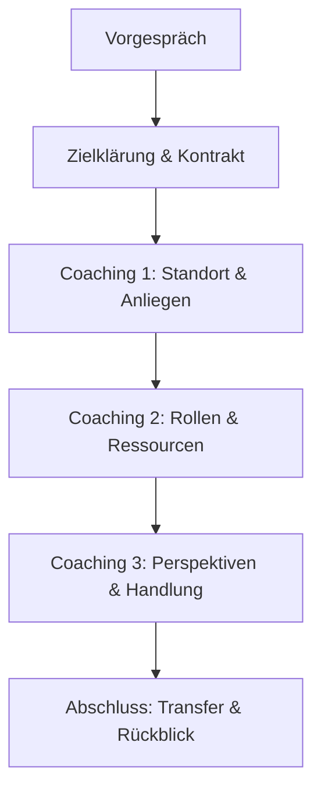

## 🧭 Praxis-Leitfaden  
### Einzelcoaching in Übergängen & Belastungen  
*Version 1.0 – für Lern- und Entwicklungseinsatz*

---

### 1. Ziel des Angebots (für Klient:innen)

Das Einzelcoaching bietet Raum zur Selbstklärung in Lebensübergängen (z. B. Ruhestand, Trennung, Rollenverlust, Pflegeverantwortung).  
Ziel ist es, Gedanken zu sortieren, Gefühle einzuordnen und neue Handlungsräume zu erschließen – ohne Therapie, aber mit strukturierter Begleitung und systemischer Haltung.

---

### 2. Erforderliche Kompetenzen & Haltungen (für dich als Coach)

**Haltung:**
- absichtslos, empathisch, zugewandt  
- Präsenz & Ruhe, auch bei emotionalen Themen  
- keine Diagnose oder Analyse – Fokus auf Selbstklärung

**Kompetenzen:**
- systemische Gesprächsführung (z. B. zirkuläre Fragen, Skalierung, Ressourcenarbeit)  
- Umgang mit Ambivalenz, Rollenverlust, diffusem Unbehagen  
- Strukturierung eines Coachingprozesses (z. B. Vorgespräch, Zielfindung, Prozessführung, Abschluss)

---

### 3. Lernziele für dich (nächste 2–3 Monate)

| Lernfeld | Ziel | Quelle / Methode |
|----------|------|------------------|
| Systemische Fragetechniken | 10 zirkuläre Fragen sicher anwenden | Übung in Rollenspielen |
| Skalenarbeit | Mindestens 3 Varianten mit passenden Formulierungen kennen | Skalen-Sammlung anlegen |
| Umgang mit Rollenübergängen | Biografische Interviewtechniken verstehen | Lektüre + Selbstreflexion |
| Gesprächsstruktur | Mindestens 2 Gesprächsformate strukturieren können | mit eigener Visualisierung |
| Haltung & Selbstklärung | eigene Trigger in Übergangsthemen erkennen | Journaling, Kollegiale Reflexion |

---

### 4. Typischer Ablauf (1:1-Prozess)

- **Dauer:** 3–5 Sitzungen à 60 Minuten  
- **Formate:** Online oder Präsenz  
- **Flexibel anpassbar**: z. B. auch als 3h-Einheit für schnelle Klärung

---

### 5. Methodenkoffer (für späteren Einsatz)

| Methode | Zweck |
|--------|-------|
| Zirkuläre Fragen | Perspektivwechsel, Systemblick |
| Lebenslinien | Rollenbiografie, Übergänge sichtbar machen |
| Skalenarbeit (0–10) | Fortschritt erfassen, Klarheit schaffen |
| Ressourcencheck | „Was hat Ihnen früher geholfen?“ |
| Figurensystem (z. B. Stühle, Karten) | externe Sicht auf innere Anteile oder Rollen |

---

### 6. Materialien & Visualisierungen

| Medium | Inhalt |
|--------|--------|
| Flipchart / Tablet | Standortkompass, Skala, Rollenfeld |
| A5-Karten | Reflexionsfragen („Woran merken Sie...?“) |
| Arbeitsblatt (PDF/Print) | Übergangslandkarte (Rollen – Verluste – neue Räume) |
| Visuals | einfache Icons für Ruhe, Klarheit, Rollen, Übergang (für Canva, PDF etc.) |

---

### 7. Übungen & Falltraining (für dich)

**Selbstlernübungen:**
- Erstelle 10 Übergangsfragen für eine fiktive Person (z. B. „Paul, 63, bald in Rente“)  
- Formuliere 3 typische Einstiegsfragen für ein Coaching mit pflegenden Angehörigen  
- Simuliere mit einem Freund / einer Kollegin ein Coaching-Vorgespräch (15 Minuten)

**Falltraining:**
- Nimm eine reale Übergangssituation aus deinem eigenen Leben als Übungsfall  
- Reflektiere in 4 Phasen: Problem – Rolle – Ressourcen – Idee  
- Optional: Interview mit einem Menschen 60+ über seine „Übergänge im Leben“

---

### 8. Stolpersteine & Reflexionsfragen

**Stolpersteine:**
- zu schnelle Lösungssuche ("ich will helfen")  
- unterschätzte emotionale Tiefe bei harmlos wirkenden Themen  
- zu starrer Gesprächsverlauf – Übergänge sind dynamisch

**Reflexionsfragen:**
- Was in mir wird aktiviert, wenn mein Gegenüber Rückzug oder Kontrollverlust zeigt?  
- Wie viel Struktur braucht der Mensch mir gegenüber gerade – und wie viel Freiraum?  
- Was hilft mir, in Übergangsthemen präsent zu bleiben, ohne zu „deuten“?

[[Prozess im Konflikt-Coaching]]