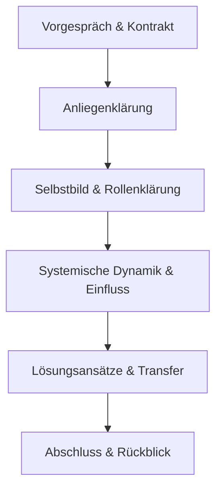

# 🎓 Modul M2 – Der Coaching-Prozess

## 📍 Ziel
Du lernst die typischen Phasen eines Coachingprozesses kennen, verstehst deren Funktion und entwickelst ein eigenes Ablaufschema, das zu deiner Zielgruppe passt.

---

## 1. 🔄 Die fünf Phasen im Coachingprozess

| Phase | Ziel der Phase | Typische Fragen |
|-------|----------------|------------------|
| 1. **Kontakt & Kontrakt** | Vertrauen & Rahmen klären | „Worum geht es? Was ist Coaching – was nicht?“ |
| 2. **Anliegenklärung** | Fokus & Ziel finden | „Was möchten Sie verändern? Was soll anders sein?“ |
| 3. **Exploration** | Muster erkennen, Perspektiven erweitern | „Wie funktioniert das System derzeit? Wer ist beteiligt?“ |
| 4. **Integration & Lösungsfindung** | Optionen entwickeln & prüfen | „Welche Ideen gibt es? Was würde helfen?“ |
| 5. **Transfer & Abschluss** | Umsetzung sichern, Wirkung reflektieren | „Was nehmen Sie mit? Was ist der nächste Schritt?“ |

---

## 2. 🧭 Ablaufmodelle im Vergleich

### 🔸 GROW-Modell (nach Whitmore)
- **G**oal – Ziel definieren  
- **R**eality – Ist-Situation analysieren  
- **O**ptions – Handlungsmöglichkeiten finden  
- **W**ill – Umsetzungswille konkretisieren

→ *Einfach, klar, besonders für fokussierte Coachings geeignet.*

---

### 🔸 St. Galler Coaching-Modell (SGCM)
- Basierend auf systemischer Sicht
- Mehrschichtige Auftrags- und Kontextklärung
- Dynamischer Wechsel von Perspektiven
- Integration von Selbstreflexion und organisationalem Lernen

→ *Für komplexe Systeme, Rollenklärung und Führung geeignet.*

---

## 3. ✍️ Übung: Eigene Prozessskizze

1. Entwerfe eine eigene Coachingstruktur in 4–6 Phasen.
2. Notiere zu jeder Phase:
   - Ziel
   - 2–3 Leitfragen
   - Passende Methoden (z. B. zirkuläre Fragen, Skalierung, Visualisierung)
3. Erstelle optional eine visuelle Darstellung (z. B. Flussdiagramm oder Mermaid-Code)

---

## 4. 📎 Beispiel: Coaching bei Führungsübernahme

---

## 5. 📝 Reflexionsfragen

- Welche Phase fällt dir leicht – welche fordert dich heraus?
- Was brauchst du, um Sicherheit in der Gesprächsstruktur zu gewinnen?
- Wie flexibel möchtest du mit diesen Phasen umgehen?
- Welche Struktur passt am besten zu deiner Zielgruppe?

---

## 🧾 Merksätze

- Coachingprozesse sind strukturiert – aber nicht linear.
- Struktur bietet Orientierung, keine Kontrolle.
- Jeder Coachingprozess beginnt mit Beziehung – und endet mit Handlung.

Weiterlesen:

[[Prozess im Konflikt-Coaching]]