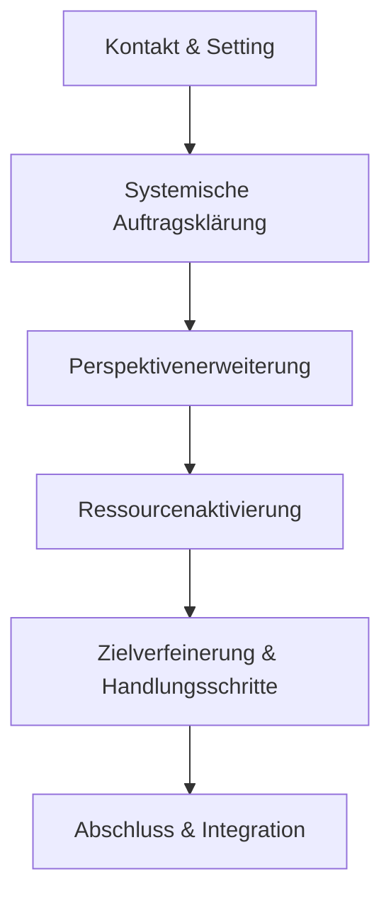

# 🧠 Vertiefung – St. Galler Coaching-Modell (SGCM)

## 📍 Ziel
Du verstehst Aufbau, Annahmen und Besonderheiten des St. Galler Coaching-Modells (SGCM) und kannst seine Prinzipien auf deine Zielgruppen anwenden.

---

## 1. 🔎 Grundidee

Das St. Galler Coaching-Modell (SGCM) ist ein **systemisch-lösungsorientiertes Modell**, das Coaching als dialogischen Lern- und Entwicklungsprozess begreift. Es verbindet **systemische Prinzipien** mit klarer Struktur und betont die **Autonomie** des Klienten.

Zentrale Annahmen:
- Menschen handeln **sinnvoll im Rahmen ihres Systems**
- Veränderung entsteht durch **neue Perspektiven**
- Der Coach steuert den Prozess, **nicht das Ergebnis**

---

## 2. 🧩 Struktur des SGCM

Das Modell unterscheidet vier **Basiselemente**, die sich dynamisch verschränken:

### 1. **Auftragsklärung**
- Systemisches Anliegen verstehen (nicht nur Symptome)
- Auftragsdreieck erfassen (Coachee – Coach – Kontextgeber)
- Realistischen Veränderungsrahmen aushandeln

### 2. **Perspektivenerweiterung**
- lineare vs. zirkuläre Logik hinterfragen
- z. B. durch Skalierung, zirkuläre Fragen, externe Visualisierung
- Ziel: neue Sichtweisen → neue Handlungen

### 3. **Ressourcenaktivierung**
- vorhandene Stärken & Muster bewusst machen
- biografische oder systemische Zugänge möglich
- Ziel: Handlungsspielräume erweitern

### 4. **Prozessintegration**
- Fortschritte festhalten, Verstärkung durch Wiederholung
- Rückfälle als Lernmöglichkeit einordnen
- Reflexion des Lernweges: „Was bleibt? Was wirkt?“

---

## 3. 🧭 Phasenstruktur (variabel nach Anliegen)

→ Diese Phasen sind **nicht linear** – z. B. kann die Zielverfeinerung bereits im ersten Gespräch beginnen.

---

## 4. 🧰 Methodenbeispiele im SGCM-Kontext

| Technik | Zweck |
|---------|-------|
| Auftragsdreieck | Verhältnis Coach ↔ Coachee ↔ Auftraggeber klären |
| Reframing | Sinn in scheinbar problematischem Verhalten entdecken |
| Skalierung (0–10) | subjektive Einschätzungen differenzieren |
| Zirkuläre Fragen | Wechselwirkungen im System erkennen |
| Ressourcenkarte | Übersicht über persönliche Stärken & Netzwerke |
| Reflecting Team | externe Resonanz nutzen (bei Gruppencoachings) |

---

## 5. ✍️ Reflexionsaufgaben

- Wo erkenne ich in meinem bisherigen Arbeiten bereits Elemente des SGCM?
- Wie gehe ich mit Mehrdeutigkeiten im Coachingauftrag um?
- Was fällt mir leicht, was schwer beim systemischen Denken?
- Wie kann ich die vier Basiselemente in ein eigenes Modell übertragen?

---

## 🧾 Merksätze

- Das SGCM ist kein starres Schema, sondern ein **Beziehungs- und Lernmodell**.
- Die Rolle des Coachs ist: **Kontext reflektieren, Dialog strukturieren, Nichtwissen aushalten.**
- Systemisches Coaching fragt nie: „Was ist wahr?“, sondern: **„Was macht den Unterschied?“**

---

## 📚 Literaturhinweis

> Giger, P., & Wirz, M. (2006). *Coaching mit Konzept. Das St. Galler Coaching-Modell.* Haupt Verlag.

