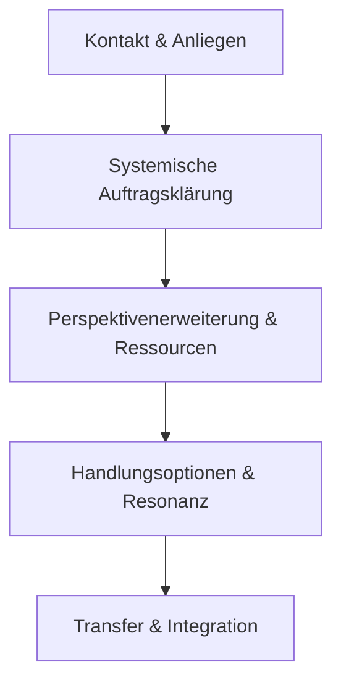

# 🎓 Modul M15 – Coaching nach dem St. Galler Prinzip

## 📍 Ziel
Du bekommst einen strukturierten Einstieg in das St. Galler Coaching-Modell (SGCM): seine Denkweise, Aufbau und Anwendung im Coachingprozess.

---

## 1. 🧠 Grundidee

Das St. Galler Coaching-Modell (SGCM) versteht Coaching als strukturierten Lernprozess mit systemischem Blick.  
Ziel ist es, Coachees dabei zu unterstützen, sich selbst und ihr System **reflektiert** und **verantwortlich** zu gestalten – ohne Beratung oder Manipulation.

---

## 2. 🔄 Die vier Basiselemente des SGCM

| Element               | Ziel / Funktion                                           |
|-----------------------|-----------------------------------------------------------|
| **Auftragsklärung**   | Anliegen erfassen, Kontext verstehen, Erwartungen klären |
| **Perspektivenerweiterung** | Muster erkennen, neue Sichtweisen ermöglichen     |
| **Ressourcenaktivierung**   | Stärken und Kompetenzen bewusst machen             |
| **Prozessintegration**     | Gelerntes verankern und handlungsfähig machen       |

Diese Elemente durchdringen alle Coachingphasen – **nicht linear**, sondern zyklisch.

---

## 3. 🧭 Phasenmodell nach SGCM

→ Jede Phase integriert Haltung, Fragen und Visualisierung.

---

## 4. 🧰 Typische Methoden im SGCM-Kontext

- Auftragsdreieck / Systemlandkarte  
- Skalierung / Reframing / Hypothetische Fragen  
- Symbolarbeit / Reflecting Team  
- Wertearbeit / Rollenklärung

---

## 💬 Leitfragen im SGCM-Stil

- „Was will sich durch dieses Coaching verändern – im System?“  
- „Wozu ist das Problem eine gute Lösung?“  
- „Wer profitiert – bewusst oder unbewusst – von der bisherigen Situation?“  
- „Welche andere Perspektive könnte hier neue Handlung ermöglichen?“

---

## ✍️ Übung: St. Galler Prinzip anwenden

1. Wähle einen bekannten Coachingfall.  
2. Skizziere ihn entlang der vier Basiselemente.  
3. Reflektiere, welche Fragen und Interventionen du wählen würdest.

---

## 🧾 Merksatz

- St. Galler Coaching ist **Haltung + Struktur + systemische Resonanz**.
