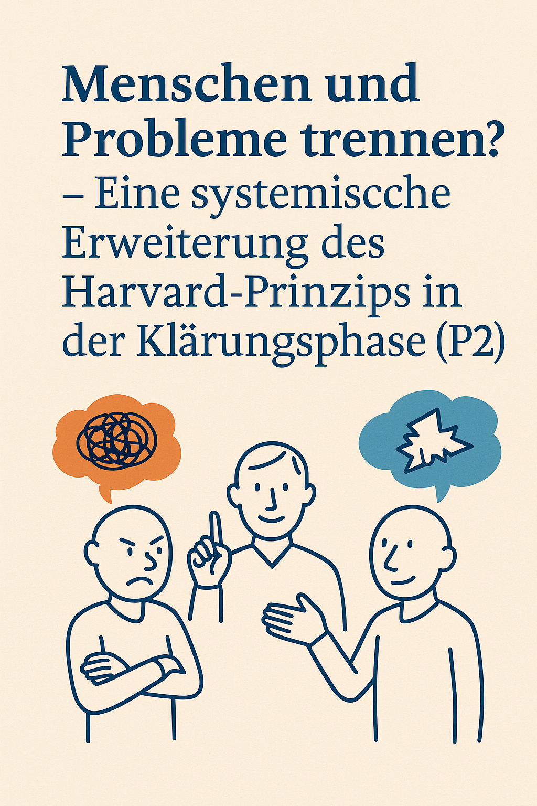

# Konflikte verstehen – Menschen respektieren – Probleme gemeinsam klären
## Ein systemisch-kritischer Blick auf das Harvard-Prinzip in Phase 2 der Mediation

### 1. Einleitung: Zwei Welten der Konfliktbearbeitung

In der Mediation prallen oft zwei unterschiedliche Denkweisen aufeinander: Die eine folgt dem bekannten Harvard-Konzept mit seinem Fokus auf sachliche Verhandlung und klarer Trennung von Person und Problem – wie im bekannten Harvard-Konzept –, die andere denkt systemisch in Zusammenhängen, Beziehungen und Beobachtungsprozessen. Beide haben ihre Berechtigung – und genau darin liegt die Herausforderung: Sie folgen unterschiedlichen Grundannahmen darüber, was ein Konflikt ist und wie er bearbeitet werden kann.

Der Blogartikel _"Konflikte verstehen statt lösen: Die Klärungsphase (P2) in der systemischen Mediation"_ rückt die Frage in den Fokus, wie Menschen über Konflikte sprechen und welche Bedeutung das für ihre Möglichkeit zur Veränderung hat. Es geht nicht darum, Lösungen zu produzieren, sondern darum, Konflikte in ihrer Systemlogik zu verstehen.

Parallel dazu stellt das Harvard-Konzept mit dem Prinzip _"Menschen und Probleme trennen"_ ein oft genutztes Werkzeug dar, das in Trainings, Verhandlungen und vielen Mediationsverfahren zum Standardrepertoire gehört. Ziel dieses Prinzips ist es, Emotionalität von der Sache zu trennen und dadurch Lösungsfindung zu erleichtern.

Doch wie passt dieses Prinzip in eine systemische Haltung? In der Klärungsphase (P2) der Mediation wird Kommunikation als Beziehungsgeschehen betrachtet, nicht als Austausch von Argumenten. Die Trennung von Person und Problem scheint hier schwieriger, da das Problem häufig durch Zuschreibungen, Deutungen und Rollenmuster überhaupt erst entsteht.

Dieser Anhang möchte beide Perspektiven nicht gegeneinander ausspielen, sondern in einen fruchtbaren Dialog bringen. Was kann das Harvard-Prinzip in P2 leisten – und was nicht? Wo bietet die systemische Sicht eine Erweiterung? Und wie lassen sich beide Zugänge methodisch reflektiert kombinieren?

Die folgenden Abschnitte beleuchten diese Fragen Schritt für Schritt – analytisch, praktisch und mit klarer Verankerung in der Mediationspraxis. Dabei wird der Bezug zu zwei zentralen Texten hergestellt:

- zum Hauptartikel: _[Konflikte verstehen statt lösen – Die Klärungsphase (P2) in der systemischen Mediation](https://mediator.sweti.de/post/klaerungsphase-p2-systemische-mediation/)_
    
- und zum vertiefenden Beitrag: _[Menschen und Probleme trennen – Eine systemische Kerntechnik in der Organisationsmediation | Mediator Sweti](https://mediator.sweti.de/post/harvard-mp/)_
    

### 2. Das Prinzip im Original: Trennen, um Klarheit zu schaffen

Das Harvard-Konzept wurde in den 1980er Jahren als pragmatischer Gegenentwurf zu eskalierenden Verhandlungsstrategien entwickelt. Es schlägt vor, Konflikte durch vier zentrale Prinzipien konstruktiv zu bearbeiten. Eines der bekanntesten: _Trenne die Menschen vom Problem_.

Die Grundidee dahinter ist einfach: Zwischenmenschliche Spannungen, persönliche Kränkungen oder emotionale Eskalationen sollen nicht mit der sachlichen Ebene des Konflikts vermischt werden. Wenn sich Konfliktparteien gegenseitig abwerten oder verletzt fühlen, blockieren sie sich oft selbst – auch dann, wenn es auf sachlicher Ebene durchaus gemeinsame Interessen gibt.

Indem Mediator:innen gezielt auf diese Trennung hinwirken, soll ein Klima entstehen, in dem die Beteiligten sich auf die inhaltliche Lösung des Problems konzentrieren können. Dazu gehören z. B. Strategien wie:

- Emotionen benennen, aber nicht analysieren,
    
- Persönliches nicht in Frage stellen,
    
- die Perspektive der anderen Seite respektieren, ohne ihr zuzustimmen,
    
- Missverständnisse klären, bevor man Inhalte verhandelt.
    

In Trainings wird oft empfohlen, den Konflikt "auf der Sachebene" zu belassen. Der Mensch bleibt wertvoll, das Problem wird lösbar. Diese Haltung ist entlastend – sie senkt die Eskalation und schafft erste Anknüpfungspunkte für Lösungsideen.

Besonders in der Organisationsmediation ist dieses Prinzip verbreitet, weil es Klarheit, Struktur und Schnelligkeit verspricht. Ein typisches Beispiel: In einem Projektteam kommt es zu Spannungen zwischen einer Führungskraft und einem Teammitglied. Die Führungskraft wünscht sich eine lösungsorientierte Klärung – ohne emotionale Eskalation. Die Trennung von Person und Problem wird hier oft als hilfreiche Strategie empfunden, um den Fokus auf Zuständigkeiten, Abläufe und Verabredungen zu lenken. Führungskräfte, HR oder Projektleitungen erhoffen sich davon eine Trennung von "emotionalem Ballast" und konkreten Lösungsschritten.

Doch gerade hier beginnt auch die Ambivalenz: Wer entscheidet, was "die Sache" ist und was "emotional"? Ist das, was stört, tatsächlich ein "Problem" – oder Ausdruck einer tiefer liegenden Systemlogik? Und: Wie umgehen mit der Tatsache, dass Konflikte nicht nur eskalieren, sondern auch Informationen transportieren?

Diese Fragen greifen wir im nächsten Abschnitt systemisch auf.

### 3. Systemische Perspektive: Warum Trennung zu kurz greift

Aus systemischer Sicht ist ein Konflikt keine Störung der Kommunikation, sondern ein bestimmter Kommunikationsmodus. Konflikte sind weder rein emotional noch rein sachlich – sie sind immer Ausdruck komplexer Wechselwirkungen zwischen Wahrnehmungen, Zuschreibungen und strukturellen Rahmenbedingungen. Deshalb lässt sich die Forderung, Menschen und Probleme zu trennen, nicht ohne Weiteres umsetzen.

Die systemische Haltung fragt nicht: _Wie trennen wir beides?_, sondern: _Wie entsteht die Wahrnehmung eines Problems durch Kommunikation über Menschen?_

Konflikte leben von Beobachtungen erster Ordnung („Du hast …“, „Ich finde …“) – doch nur durch Beobachtung zweiter Ordnung wird die Konfliktdynamik sichtbar („Wie kommt es, dass wir so unterschiedlich auf die gleiche Situation schauen?“). Gerade in der Klärungsphase ist es entscheidend, beide Ebenen überhaupt nebeneinander stehen lassen zu können.

In diesem Sinn wirkt die Forderung nach Trennung eher wie eine technische Vereinfachung – hilfreich in Verhandlungen, aber zu eng in Kontexten, in denen die Konfliktkommunikation selbst das eigentliche Geschehen ist.

Die Beziehung der Beteiligten zum „Problem“ ist nicht neutral. Vielmehr ist das Problem – systemtheoretisch betrachtet – eine **Beobachtung zweiter Ordnung** – es entsteht aus Differenzierungen: zwischen Normalem und Abweichung, Zuständigkeit und Ohnmacht, Loyalität und Regelbruch.

Wenn eine Seite beispielsweise sagt: „Ich halte diese Kollegin für unprofessionell“, dann ist das nicht nur eine Sachkritik, sondern Ausdruck eines Beobachtungsfilters – oft verbunden mit Rollenerwartungen, Selbstschutz oder unausgesprochenen Loyalitäten. Diese mitschwingenden Bedeutungsgeflechte werden durch eine einfache Trennung von Person und Problem unsichtbar gemacht.

Systemisches Arbeiten in P2 zielt deshalb nicht auf Trennung, sondern auf **Erweiterung**: Ein Beispiel: Zwei Teammitglieder beschreiben denselben Vorfall – eine geplatzte Deadline – völlig unterschiedlich. Die eine Seite spricht von mangelnder Kommunikation, die andere von Desinteresse. Durch systemisches Fragen wird deutlich, dass beide unterschiedliche Erwartungen an Rollen und Verantwortung haben. Erst durch das Erkennen dieser Perspektivenvielfalt kann sich eine neue Deutungsebene öffnen, auf der Verständigung möglich wird. Wie kann eine Konfliktpartei ihre Zuschreibungen beobachten lernen, ohne sie sofort aufzugeben? Wie kann die andere Seite erfahren, dass sie nicht objektiv „das Problem“ ist, sondern Teil einer wechselseitigen Dynamik?

Methodisch geschieht das etwa durch zirkuläres Fragen, Perspektivensplitting, Hypothesenbildung oder durch das bewusste Sichtbarmachen kommunikativer Muster – allesamt Techniken, die die inneren Landkarten der Beteiligten differenzieren, ohne sie zu pathologisieren.

### 4. Praxisbeispiel & methodische Integration

Ein typisches Beispiel: Zwei Mitarbeitende streiten sich wiederholt über die Einhaltung von Zuständigkeiten. Die Führungskraft bittet um Mediation. Die Konfliktparteien äußern sich abwechselnd – es geht scheinbar um Zuständigkeit und Prioritäten. Doch hinter den Positionen stehen tieferliegende Deutungsmuster: Die eine Seite fühlt sich regelmäßig übergangen und emotional entwertet, die andere erlebt sich als ständig blockiert und ungehört.

Ein klassischer Harvard-Zugang würde versuchen, Missverständnisse aufzulösen, Bedürfnisse zu ermitteln und gemeinsame Standards zu definieren. Das kann bereits hilfreich sein, reicht aber oft nicht aus. Systemische Interventionen erweitern die Perspektive:

- **Zirkuläre Fragen** helfen, das Bild der jeweils anderen Seite zu differenzieren: „Was glauben Sie, wie Ihre Kollegin Ihre Reaktion versteht?“
    
- **Kontextverschiebung** ermöglicht neue Bedeutungsrahmen: „Angenommen, Sie wären Zuschauerin dieser Situation – was fällt Ihnen auf?“
    
- **Hypothesenbildung** macht Unsichtbares sichtbar: „Könnte es sein, dass das Thema 'Zuständigkeit' auch für Ihre eigene Rollensicherheit steht?“
    

Im Zusammenspiel dieser Ansätze entsteht eine neue Qualität: Die Beteiligten verlassen die Ebene wechselseitiger Vorwürfe und gewinnen eine Metaperspektive auf ihre Kommunikations- und Deutungsmuster. Es geht nicht mehr darum, wer Recht hat, sondern wie beide Seiten zur aktuellen Dynamik beitragen – und wie sie gemeinsam neue Bedeutungsräume erschließen können. Die Beteiligten erkennen, dass das Problem kein objektives Ding ist, sondern ein _Produkt ihrer wechselseitigen Konstruktionen_. Das Ziel ist nicht Trennung, sondern **Verständigungsfähigkeit** – eine geteilte Metasicht auf die Dynamik.

In diesem Sinne lässt sich das Harvard-Prinzip nicht ersetzen, sondern **transzendieren**: Nicht indem man es aufgibt, sondern indem man es _einbettet_ in eine Haltung, die Mehrdeutigkeit, Emotionalität und Strukturdimensionen nicht ausklammert, sondern systematisch nutzbar macht.

### 5. Fazit: Integration statt Entweder-oder

Das Prinzip „Menschen und Probleme trennen“ hat seinen Platz – vor allem dort, wo Eskalationen reduziert, Missverständnisse geklärt und sachliche Lösungsräume geschaffen werden sollen. Es bringt Struktur in chaotische Konfliktsituationen und hilft, Gespräche auf Augenhöhe zu führen.

Doch systemisch gedacht reicht es nicht aus. Wer Konflikte lediglich auf einer rationalen Ebene ordnet, übersieht ihre Bedeutung als Ausdruck eines sozialen Systems. Konflikte sind nicht nur Interaktionen zwischen Personen – sie sind Spiegel von Erwartungen, Regeln, Loyalitäten und blinden Flecken. Sie sichtbar zu machen, verlangt mehr als Trennung: Es verlangt **komplexes Verstehen**.

Systemische Mediation integriert das Harvard-Prinzip, ohne ihm zu verfallen: Sie nimmt dessen Stärke – die Orientierung an Klarheit und Struktur – auf, lässt aber zugleich Raum für die Dynamik und Vielschichtigkeit sozialer Systeme. So wie ein Architekt nicht nur statische Linien zieht, sondern auch Licht, Raumgefühl und Bewegung mitdenkt, so erweitert systemisches Arbeiten die Harvard-Technik um die Dimension der inneren Landkarten, der Beziehungsmuster und der Bedeutungsrahmen. Die Integration besteht darin, zwischen Struktur und Sinn zu vermitteln – und in der Vermittlung neue Lösungen entstehen zu lassen.. Sie nutzt dessen Klarheit – und erweitert sie um Beobachtung zweiter Ordnung, Hypothesenarbeit und Kontextsensibilität. So entsteht eine Haltung, die Konflikte nicht nur zu lösen versucht, sondern sie auch als Chance zur Entwicklung versteht.

Für Mediator:innen und Berater:innen bedeutet das: Methoden dürfen nebeneinander stehen – entscheidend ist die Haltung, mit der sie angewendet werden.

> Wer in der Klärungsphase (P2) nicht nur sortiert, sondern Sinn erschließt, öffnet Räume für echte Veränderung.
