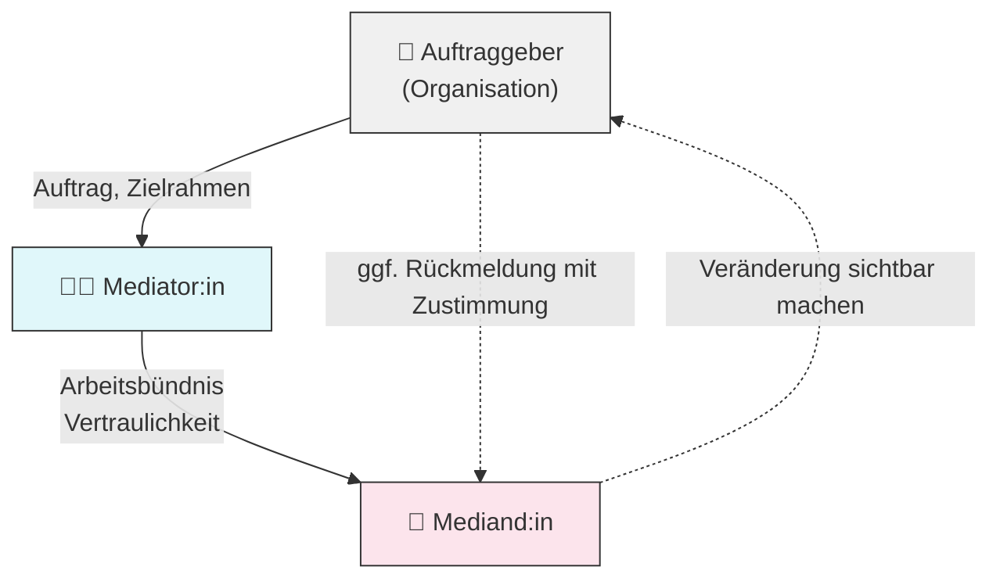

## Einleitung

Der sogenannte **Dreieckvertrag nach Fanita English** beschreibt ein spezifisches Vertragsverhältnis zwischen drei beteiligten Parteien in Coaching-, Mediations- oder Supervisionsprozessen in Organisationen. Das Konzept stammt aus der **Transaktionsanalyse (TA)** und ermöglicht eine klare Rollenklarheit sowie ethisch fundiertes Arbeiten im Spannungsfeld zwischen Auftraggeber, Mediator und Mediand.

---

## 1. Das Konzept des Dreieckvertrags

Der Dreieckvertrag regelt die Beziehung zwischen:

- **Auftraggeber** (z. B. Führungskraft, Personalabteilung, Organisation)
    
- **Mediator:in / Coach / Supervisor:in** (Prozessbegleitung)
    
- **Mediand / Coachee / Supervisand** (Betroffene Person)
    

Ziel ist es, **klare Zuständigkeiten**, **gegenseitige Erwartungen** und den **Zweck der Maßnahme** zu klären – ohne die Rollen zu vermischen.

---

## 2. Struktur des Dreieckvertrags

Der Dreieckvertrag besteht aus zwei verbundenen Einzelverträgen:

1. **Auftragsvertrag** zwischen Auftraggeber und Mediator:
    
    - Auftrag, Kontext, Rahmenbedingungen
        
    - keine inhaltliche Einflussnahme auf Prozessdetails
        
2. **Arbeitsbündnis** zwischen Mediator und Mediand:
    
    - Zielklärung
        
    - Vertraulichkeit
        
    - Freiwilligkeit der Teilnahme
        

Zwischen Mediand und Auftraggeber besteht kein direkter Vertrag – wohl aber eine Rollenverbindung, die reflektiert werden muss.

---

## 3. Das Vertragskonzept in der Transaktionsanalyse

Die Transaktionsanalyse unterscheidet:

- **administrative Verträge** (Rahmen, Zeiten, Honorar)
    
- **professionelle Arbeitsverträge** (Ziele, Entwicklungsschritte)
    
- **psychologische Verträge** (unausgesprochene Erwartungen, Bedürfnisse)
    

In Dreiecksverhältnissen müssen alle Ebenen **transparent, offen und gemeinsam** verhandelt werden. Besonders wichtig ist die **doppelte Verantwortlichkeit** des Mediators: einerseits gegenüber dem Auftraggeber, andererseits gegenüber dem Prozess.

---

## 4. Autonomie als Ziel der TA

Die Transaktionsanalyse versteht **Autonomie** als Fähigkeit zur:

- **Bewusstheit** (statt Automatismen)
    
- **Spontaneität** (neues Verhalten)
    
- **Intimität** (authentische Begegnung)
    

Der Dreieckvertrag schützt diese Autonomie, indem er dem Medianden einen **sicheren Raum für Veränderung** bietet – ohne Erwartungsdruck durch Dritte.

---

## 5. Ich-Zustands-Modell und Rollenklarheit

Das Struktur- und Funktionsmodell der TA unterscheidet:

- **Eltern-Ich** (kritisch/fürsorglich)
    
- **Erwachsenen-Ich** (sachlich, realitätsbezogen)
    
- **Kind-Ich** (angepasst/frei)
    

In einem Dreieckssystem ist es essenziell, dass **alle Beteiligten aus dem Erwachsenen-Ich** agieren:

- Auftraggeber: realistische Erwartungen
    
- Mediator: Klarheit über Rollen
    
- Mediand: reflektierte Mitarbeit
    

---

## 6. Drama-Dreieck und Rollenklarheit

Das **Drama-Dreieck nach Karpman** beschreibt destruktive Rollenmuster:

- Retter: "Ich weiß, was gut für dich ist."
    
- Verfolger: "Du musst dich ändern!"
    
- Opfer: "Ich kann nichts tun."
    

Der Dreieckvertrag schützt vor unbewusster Rollenverstrickung, indem er:

- Erwartungen offenlegt
    
- Verantwortlichkeiten verteilt
    
- Selbstwirksamkeit fördert
    

---

## 7. Ethik und Schutz der inneren Prozesse

TA legt großen Wert auf **ethische Grundsätze**:

- Vertraulichkeit (besonders zwischen Mediator und Mediand)
    
- Transparenz bei Rückmeldungen
    
- Schutz vor Manipulation durch Dritte
    

Der Mediator darf keine Inhalte ohne Einverständnis weitergeben und muss **Grenzen der Loyalität** aktiv steuern.

---

## 8. Fazit: Schlussfolgerungen für die Praxis

Der Dreieckvertrag ist mehr als eine formale Vereinbarung – er ist ein **pädagogisch-ethisches Instrument**:

- Er schafft **Vertrauensräume** innerhalb organisationaler Systeme
    
- Er fördert **systemisches Denken** und **Rollenbewusstsein**
    
- Er sichert die Grundlage für echte Veränderung und nachhaltige Entwicklung
    

**Für Berater:innen mit TA-Hintergrund ist der Dreieckvertrag unverzichtbar**, um zwischen Prozessverantwortung und institutionellen Erwartungen balancieren zu können.

---

## 9. Mermaid-Diagramm

---

**Literaturempfehlung**:

- Fanita English: "The Three-Cornered Contract" (1987)
    
- Berne, Eric: "Games People Play"
    
- Rolf Balling: "Coaching und Transaktionsanalyse"