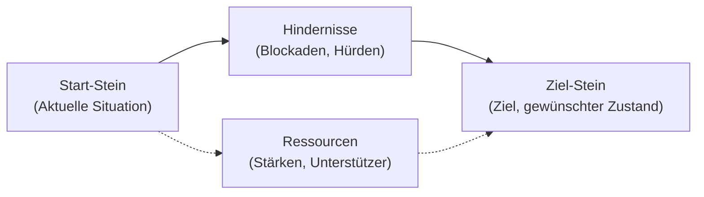

# Zielarbeit mit Kommunikations-Bausteinen

Die Methode nutzt verschiedene Bauklötze (Kommunikations-Bausteine), um Ziele, Hindernisse und Ressourcen sichtbar und bearbeitbar zu machen.  
Sie wird in Coaching, Mediation und Beratung eingesetzt, wenn **abstrakte Zielvorstellungen konkretisiert** und **Handlungsoptionen visualisiert** werden sollen.

---

## Ablauf

1. **Rahmenklärung**  
   - Zieldefinition: *„Worum geht es Ihnen, wohin möchten Sie?“*  
   - Erklärung der Methode: Bausteine stehen symbolisch für Ziel, Ausgangspunkt, Hindernisse und Ressourcen.

2. **Ziel symbolisieren**  
   - Ein auffälliger Stein wird als **Ziel-Stein** definiert und im Raum/auf dem Tisch platziert.  
   - Ziel bewusst etwas entfernt vom Start positionieren → Distanz sichtbar machen.

3. **Ausgangssituation darstellen**  
   - Ein zweiter Stein repräsentiert den **aktuellen Standpunkt** („Wo stehe ich gerade?“).

4. **Hindernisse markieren**  
   - Hindernis-Steine werden zwischen Ausgangs- und Ziel-Stein gestellt.  
   - Größe, Position, Anzahl → zeigen Gewicht und Wahrnehmung der Hürden.

5. **Ressourcen und Unterstützer einbeziehen**  
   - Steine für Stärken, Unterstützung, Chancen, Werte.  
   - Hinter dem Start-Stein („das gibt mir Kraft“) oder am Weg („das hilft unterwegs“).

6. **Wege gestalten**  
   - Coachee legt mögliche Wege mit Steinen → Brücken, Etappen, Umwege.  
   - Varianten vergleichen.

7. **Reflexion**  
   - Leitfragen:  
     - „Welcher Weg fühlt sich realistisch an?“  
     - „Welche Hindernisse können Sie verschieben/verkleinern?“  
     - „Welche Ressource rückt näher ans Ziel?“  
     - „Welche Zwischenstationen sind wichtig?“

8. **Handlungsplan sichern**  
   - Modell fotografieren oder skizzieren.  
   - Erste konkrete Schritte ableiten: *„Was ist der nächste kleine Schritt?“*

---

## Vorteile

- Ziele werden **sichtbar und begreifbar**.  
- Blockaden und Ressourcen erscheinen **objektiviert** auf dem Tisch.  
- Erhöht **Kreativität und Motivation**.  
- Unterstützt **Partizipation und Eigenverantwortung**.

---

## Beispiel (vereinfacht)

- **Ziel-Stein**: Gelassenheit im Job (großer blauer Klotz)  
- **Start-Stein**: Ich heute (kleiner Holzklotz)  
- **Hindernisse**: Zeitdruck, Chef, Perfektionismus  
- **Ressourcen**: Kollegin, Erfahrung, Humor  
- **Weg-Steine**: Pausen, Nein-Sagen lernen, Feedback einholen

---

## Einsatzfelder

- **Coaching**: Persönliche Ziele, Rollenkonflikte, Ressourcenarbeit  
- **Mediation**: Gemeinsames Bild eines Ergebnisses oder einer Lösung entwickeln  
- **Beratung**: Veränderungsprozesse strukturieren, Handlungsoptionen sichtbar machen

---

### 🔎 Erklärung
- **A → B → D**: Der direkte Weg vom Start zum Ziel führt durch die Hindernisse.  
- **A -.-> C -.-> D**: Ressourcen flankieren den Weg, sie können helfen, Hindernisse zu überwinden oder zu umgehen.  

