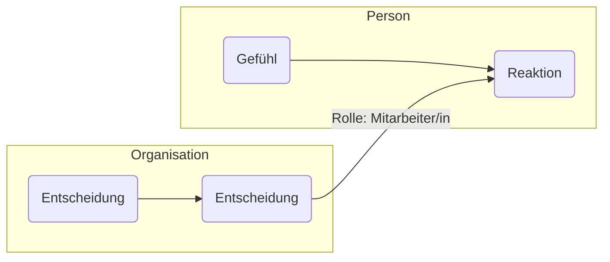

### 1. Was ist strukturelle Kopplung?

Strukturelle Kopplung beschreibt, **wie zwei oder mehr autopoietische Systeme einander beeinflussen**, ohne ihre Eigenlogik aufzugeben. Es ist keine Steuerung, sondern ein **wechselseitiges Ermöglichen von Anschlusskommunikation**.

**Beispiel:**

- Das Rechtssystem und das politische System sind strukturell gekoppelt: Gesetze (Recht) entstehen durch politische Entscheidungen, müssen aber rechtlich kommunizierbar bleiben.
    

---

### 2. Merkmale struktureller Kopplung

- **Eigenständige Operationen**: Jedes System bleibt in seiner Logik operativ geschlossen.
    
- **Irritation durch Struktur**: Systeme können sich nicht direkt beeinflussen, aber strukturell voraussetzbar sein.
    
- **Kopplung über spezifische Medien oder Rollen**: Es gibt Funktionsstellen, die beide Systeme bedienen können.
    

**Typische Kopplungsformen:**

- Rolle: Lehrer:in (Pädagogik + Organisation)
    
- Medium: Geld (Wirtschaft + Gesellschaft)
    
- Funktion: Richter:in (Recht + Staat)
    

---

### 3. Relevanz für Praxis in Beratung, Coaching, Mediation

Viele Probleme entstehen an den **Schnittstellen**:

- Mitarbeitende zwischen Familie und Organisation
    
- Teams zwischen Hierarchie und Selbststeuerung
    
- Projekte zwischen Politik, Recht, Technik
    

**Verstehen von Kopplung** hilft dabei:

- Konflikte nicht als Störung, sondern als Ausdruck mehrdeutiger Systemlogiken zu begreifen
    
- Interventionen so zu gestalten, dass **beide Seiten anschlussfähig** bleiben
    

**Frage:** Was braucht ein System, um die Irritation des anderen verarbeiten zu können?

---

### 4. Visualisierung

In diesem Beispiel vermittelt die **Rolle der Mitarbeiter:in** zwischen Organisation (Entscheidungen) und Person (Gefühle).

---

### 5. Reflexionsfragen

1. Welche strukturellen Kopplungen begegnen dir in deiner Praxis?
    
2. Wann entstehen Konflikte durch unklare oder überforderte Kopplungen?
    
3. Wie könntest du strukturelle Kopplung sichtbar machen?
    
4. Welche Rollen hast du selbst eingenommen, die zwei Systeme verbunden haben?
    

---

### 6. Vorschau auf Lektion 6

In der nächsten Lektion geht es um **funktionale Differenzierung**: Warum moderne Gesellschaften in Teilsysteme zerfallen und wie das unser Denken und Handeln beeinflusst.