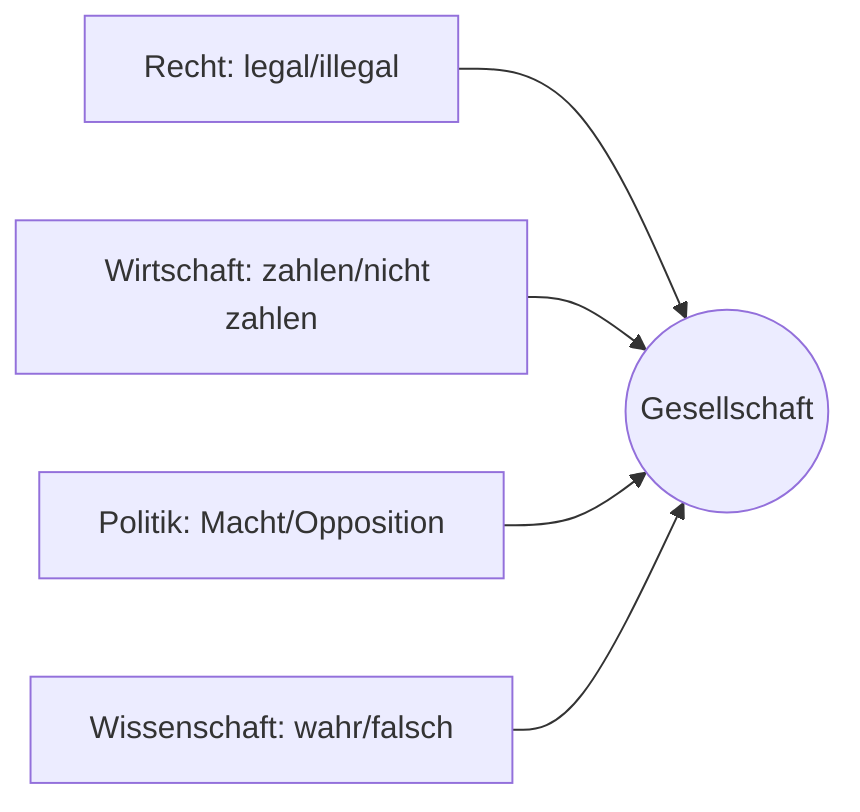

### 1. Was bedeutet funktionale Differenzierung?

Funktionale Differenzierung beschreibt, wie sich **die moderne Gesellschaft in spezialisierte Teilsysteme aufspaltet**, die jeweils nach einer eigenen Logik operieren. Jedes dieser Systeme ist autopoietisch und kommuniziert nur nach seinen eigenen Regeln.

**Beispiele für Teilsysteme und ihre Codes:**

* **Recht**: legal / illegal
* **Wirtschaft**: zahlen / nicht zahlen
* **Politik**: Macht / Opposition
* **Wissenschaft**: wahr / falsch
* **Medizin**: krank / gesund
* **Erziehung**: lernen / nicht lernen

---

### 2. Historischer Hintergrund

Früher waren Gesellschaften segmentiert (z. B. nach Stämmen, Klassen) oder stratifiziert (z. B. Adel / Bauern). Die Moderne zeichnet sich dadurch aus, dass:

* **Funktion ersetzt Herkunft**
* Jeder Mensch potenziell Zugang zu mehreren Systemen hat (z. B. Bildung, Recht, Wirtschaft)
* Kein System dominiert dauerhaft über andere

---

### 3. Merkmale funktional differenzierter Systeme

* **Eigenlogik und Selbstreferenz**: Jedes System entscheidet selbst, was für es relevant ist
* **Kommunikative Geschlossenheit**: Keine direkten Übersetzungen zwischen den Systemen
* **Beobachtung über die Umwelt**: Systeme sehen einander als Umwelt

**Beispiel:** Ein Gerichtsurteil kann wirtschaftliche Folgen haben, aber es bleibt eine rechtliche Kommunikation.

---

### 4. Relevanz für Praxis in Beratung, Coaching, Mediation

**Warum ist funktionale Differenzierung wichtig?**

* Viele Konflikte resultieren aus Missverständnissen zwischen Systemlogiken (z. B. Moral vs. Recht, Gefühl vs. Organisation)
* Beratung hilft, diese Differenzen zu **erkennen und zu übersetzen**, ohne sie aufzuheben
* Mediation kann eine **Übersetzungsbrücke** bauen, aber nicht die Systemlogiken selbst verändern

**Frage:** Welche Systemlogiken sind im aktuellen Konflikt am Werk?

---

### 5. Visualisierung

---

### 6. Reflexionsfragen

1. Welche Teilsysteme erkennst du in deinem Arbeitsalltag?
2. Wann werden unterschiedliche Systemlogiken verwechselt oder vermischt?
3. Welche Rolle spielst du in der Übersetzung oder Vermittlung zwischen diesen Logiken?
4. In welchen Situationen kann es hilfreich sein, eine Logik bewusst zurückzustellen?

---

### 7. Vorschau auf Lektion 7

In Lektion 7 geht es um das Konzept der **Beobachtung und Beobachtung zweiter Ordnung**: Wie Systeme ihre Umwelt beobachten – und wie du als Berater\:in diese Beobachtung beobachten kannst.