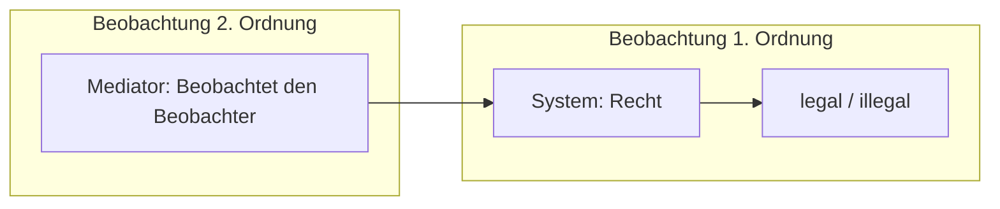

### 1. Was bedeutet Beobachtung in der Systemtheorie?

In Luhmanns Theorie ist "Beobachtung" **nicht das passive Wahrnehmen**, sondern eine **Unterscheidung mit Benennung**. Ein System beobachtet, wenn es:

- einen Unterschied macht (z. B. krank/gesund)
    
- einen der beiden Seiten benennt (z. B. "gesund")
    

**Beispiel:** Die Medizin beobachtet, ob ein Zustand krankhaft ist oder nicht. Sie trifft Entscheidungen auf Basis dieser Unterscheidung.

---

### 2. Beobachtung erster Ordnung

Dies ist die klassische Beobachtung **innerhalb eines Systems**. Sie ist immer **an die Logik des Systems gebunden**.

**Beispiele:**

- Ein Gericht beobachtet einen Sachverhalt rechtlich (legal/illegal)
    
- Ein Unternehmen beobachtet einen Markt wirtschaftlich (lohnend/nicht lohnend)
    
- Ein Coach beobachtet Verhalten im Hinblick auf Motivation, Ressourcen oder Ziele
    

> Beobachtung erster Ordnung fragt: **Was ist das?**

---

### 3. Beobachtung zweiter Ordnung

Hier wird nicht nur beobachtet, **was** beobachtet wird – sondern **wie** etwas beobachtet wird.

**Zentrale Idee:**

> Ein System (oder Beobachter:in) beobachtet, **wie ein anderes System beobachtet.**

**Beispiele:**

- Der Mediator beobachtet, wie zwei Parteien ihre Wirklichkeit konstruieren
    
- Ein Supervisor erkennt, dass ein Teamkonflikt durch unterschiedliche Erwartungslogiken entsteht
    
- Ein Coach reflektiert nicht nur das Ziel, sondern auch das Zielbild des Klienten
    

> Beobachtung zweiter Ordnung fragt: **Wie kommt jemand zu seiner Wahrnehmung?**

---

### 4. Relevanz für Beratung, Coaching, Mediation

**Beobachtung zweiter Ordnung ist die zentrale Kompetenz systemischer Praxis.**

- Sie hilft, Konflikte nicht nur inhaltlich, sondern **strukturell** zu verstehen
    
- Sie unterstützt **Neutralität ohne Beliebigkeit**
    
- Sie ermöglicht, blinde Flecken sichtbar zu machen
    
- Sie erlaubt Interventionen, die **nicht direktiv**, sondern reflektierend sind
    

**Beispiel:**

> In einer Mediation merkst du, dass Person A alles moralisch bewertet, Person B aber funktional (z. B. nach Nutzen). Die eigentliche Differenz liegt nicht im Thema, sondern im Beobachtungsmodus.

---

### 5. Visualisierung

---

### 6. Reflexionsfragen

1. Wann hast du zuletzt beobachtet, wie jemand anders beobachtet?
    
2. In welchen Situationen kann dir eine Beobachtung zweiter Ordnung helfen, neutral zu bleiben?
    
3. Welche Logiken der Beobachtung kennst du aus deinem Arbeitsfeld?
    
4. Wo könnte eine "zweite Beobachtung" für mehr Klarheit sorgen?
    

---

### 7. Vorschau auf Lektion 8

In Lektion 8 geht es um den **Begriff "Sinn"** in der Systemtheorie: Wie Systeme Komplexität strukturieren und worauf sie ihre Aufmerksamkeit richten können.