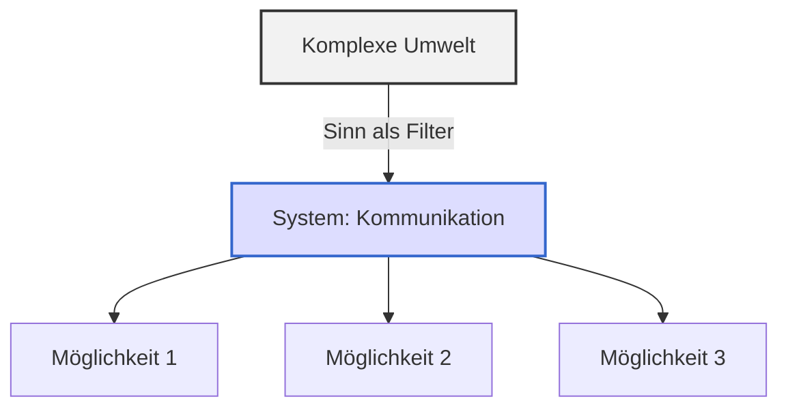

### 1. Warum braucht ein System "Sinn"?

In einer Welt voller Möglichkeiten braucht jedes System eine **Orientierung**, um Entscheidungen zu treffen. Der Begriff **Sinn** beschreibt in der Luhmannschen Systemtheorie die **Möglichkeit der Anschlusskommunikation**: Welche Themen, Perspektiven und Informationen sind relevant, anschlussfähig, bearbeitbar?

> "Sinn ist die Form, die Komplexität verarbeitet, ohne sie zu zerstören."

---

### 2. Eigenschaften des Sinns

- **Sinn ist kontingent**: Es hätte auch anders sein können
    
- **Sinn ist selektiv**: Er schließt aus, was nicht passt
    
- **Sinn ist temporär**: Er richtet sich nach Gegenwart, Vergangenheit und Zukunft
    
- **Sinn strukturiert Kommunikation**: Er zeigt, was erwartbar, zumutbar, anschlussfähig ist
    

**Beispiel:**  
In einem Teammeeting wird nicht über Gefühle gesprochen. Das bedeutet nicht, dass sie nicht vorhanden sind – sondern dass sie **nicht sinnvoll anschlussfähig** sind im gegebenen Kommunikationskontext.

---

### 3. Sinn als Medium

Luhmann bezeichnet Sinn als ein **Medium** wie Sprache oder Vertrauen. In diesem Medium bewegen sich Systeme:

- Sie strukturieren Möglichkeiten
    
- Sie geben Ereignissen Bedeutung
    
- Sie machen Komplexes bearbeitbar
    

**Praxisbezug:**

- Sinn ermöglicht, dass Kommunikation nicht bei jedem Schritt alle Optionen durchrechnen muss
    
- Sinn ist wie ein Filter, der aus der Umwelt auswählt, was das System verarbeitet
    

---

### 4. Sinn und Beratung

In Coaching, Mediation und Beratung arbeiten wir **nicht an "der Wahrheit"**, sondern an der **(Re-)Konstruktion von Sinn**:

- Welche Deutungen erscheinen plausibel?
    
- Welche Anschlüsse werden ermöglicht oder verhindert?
    
- Welche neue "Sinnangebote" können gemacht werden?
    

**Typische Intervention:**

> "Was ergibt für Sie im Moment Sinn?"  
> "Was wäre ein sinnvoller nächster Schritt, auch wenn er nicht perfekt ist?"

---

### 5. Visualisierung

---

### 6. Reflexionsfragen

1. Welche Sinnstrukturen erkennst du in deiner Organisation oder bei deinen Klient:innen?
    
2. Wann erlebst du Kommunikation als "sinnlos"? Was heißt das systemtheoretisch?
    
3. Welche neuen Sinnangebote hast du in deiner Praxis erfolgreich eingeführt?
    
4. Wie kannst du Sinn-Rahmen erweitern, ohne sie aufzuzwingen?
    

---

### 7. Vorschau auf Lektion 9

In der nächsten Lektion geht es um die **Zeitdimension** der Systemtheorie: Warum Systeme immer gegenwärtig operieren, aber Vergangenheit und Zukunft mitverarbeiten.