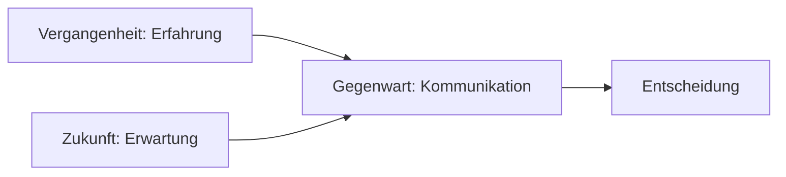

## Lektion 9 – Zeit in der Systemtheorie: Gegenwart, Vergangenheit, Zukunft

### 1. Warum ist Zeit für soziale Systeme zentral?

Systeme operieren immer **in der Gegenwart**. Aber jede Kommunikation bezieht sich auch auf **Vergangenes** und antizipiert **Zukünftiges**. Zeit ist damit ein strukturierendes Medium, um Sinn zu erzeugen und Entscheidungen möglich zu machen.

> "Zeit ist nicht das, was vergeht. Zeit ist das, was anschlussfähig macht."

---

### 2. Drei Zeithorizonte sozialer Systeme

Luhmann beschreibt Zeit als **Triade**:

* **Vergangenheit**: Speicher für Erfahrung, Routinen, Erinnerungen
* **Gegenwart**: Ort der Operation (hier entsteht Kommunikation)
* **Zukunft**: Erwartung, Planung, Projektion

**Wichtig:** Nur in der Gegenwart wird entschieden, aber auf Basis von Vergangenheitsdeutungen und Zukunftserwartungen.

---

### 3. Zeitbindung, Stabilität und Veränderung

**Was ist Zeitbindung?**

Zeitbindung beschreibt die Weise, wie soziale Systeme Vergangenes und Zukünftiges in der Gegenwart verarbeiten. Systeme operieren ausschließlich in der Gegenwart, greifen dabei aber auf frühere Kommunikation zurück (z. B. Erfahrungen, Routinen) und richten sich auf erwartete Entwicklungen aus (z. B. Planungen, Ziele). Zeitbindung schafft **Anschlussfähigkeit über Zeit hinweg**, ohne dass ein System "alle Zeit" überblicken oder kontrollieren könnte.

Luhmann beschreibt Zeitbindung als eine zentrale Voraussetzung für Sinnstiftung: Erst durch das Einordnen von Ereignissen in zeitliche Zusammenhänge entstehen Struktur, Erwartung und Bedeutung.

Soziale Systeme stehen in einem ständigen Spannungsfeld zwischen **Stabilität** und **Veränderung**. Zeit ist dabei nicht nur ein Maß für Dauer, sondern ein zentrales Medium, das hilft, dieses Spannungsfeld auszubalancieren.

* **Was meint Stabilität?**

Stabilität bezeichnet die Fähigkeit eines sozialen Systems, über Zeit hinweg anschlussfähige Erwartungen aufrechtzuerhalten. Dazu zählen wiederkehrende Abläufe, Rollenerwartungen, Routinen, Vorschriften und Standardprozesse. Diese Stabilität ist notwendig, damit Kommunikation nicht bei jedem Schritt alles neu verhandeln muss. Für Luhmann ist Stabilität kein starres Festhalten, sondern eine Voraussetzung für Anschlusskommunikation.

**Was meint Veränderung?**

Veränderung bedeutet, dass ein System neue Formen der Kommunikation entwickelt, auf Irritationen reagiert oder seine Strukturen anpasst. Systeme müssen sich an veränderte Umwelten anpassen, indem sie ihre Erwartungen modifizieren oder neue Handlungsmuster entwickeln. Diese Fähigkeit zur Veränderung ist selbst Teil der Stabilität.

**Was sagt Luhmann zum Zusammenspiel?**

Luhmann betont: "Systeme müssen stabil genug sein, um sich verändern zu können." Das bedeutet: Veränderung ist nicht das Gegenteil von Stabilität, sondern ihre dynamische Weiterentwicklung. Systeme verarbeiten Veränderung durch die Stabilität ihrer Unterscheidungen, Kategorien und Entscheidungsprogramme. Zeit fungiert dabei als Medium, um diese Entwicklungen strukturiert und selektiv zu verarbeiten.

**Systeme sind auf Stabilität und Erwartungssicherheit angewiesen:** Wiederkehrende Abläufe, Routinen, Zuständigkeiten und Rollenerwartungen schaffen Verlässlichkeit. Ohne eine gewisse Vorhersehbarkeit könnten soziale Systeme keine Erwartungen aufbauen, keine Verträge schließen und keine Kooperation organisieren.

**Gleichzeitig müssen Systeme Ungewissheit, Kontingenz und Veränderung verarbeiten:** Neue Ereignisse, Störungen oder veränderte Anforderungen (z. B. durch Technik, Markt, Politik) stellen die bisherigen Muster infrage. Systeme müssen daher fähig sein, ihre Erwartungen zu überprüfen und anzupassen.

**Zeit hilft, das Unwahrscheinliche wahrscheinlicher zu machen**, indem sie Erwartungen strukturiert: Was ist kurzfristig möglich? Was soll langfristig gelten? Wann ist ein guter Moment für Veränderung? Diese Strukturierung erfolgt über Pläne, Fristen, Kalender, Ziele und Strategien. indem sie Erwartungen strukturiert: Was ist kurzfristig möglich? Was soll langfristig gelten? Wann ist ein guter Moment für Veränderung? Diese Strukturierung erfolgt über Pläne, Fristen, Kalender, Ziele und Strategien.

**Beispiel:**
Ein Projektteam plant eine Deadline. Obwohl niemand sicher sagen kann, ob sie eingehalten wird, schafft die Festlegung der Deadline einen Referenzpunkt. Daraufhin entstehen regelmäßige Meetings, eine Aufgabenverteilung, ein Ressourceneinsatz – die Kommunikation richtet sich zeitlich aus. Selbst bei Abweichungen sorgt die Zeitstruktur für Orientierung und Handlungssicherheit.

---

### 4. Zeiterleben in Beratung, Coaching, Mediation

**Typische Phänomene:**

* Klient\:innen sind gefangen in "alten Geschichten" (Vergangenheit)
* Konflikte kreisen um nicht realisierbare Zukünfte
* Entscheidungen werden aufgeschoben, weil "die Zeit nicht reif ist"

**Systemischer Zugang:**

* Beratende können helfen, Zeitdimensionen bewusst zu machen
* Reflexion über Zeitbindung kann Handlungsfähigkeit fördern

**Typische Interventionen:**

> "Was war früher hilfreich?"
> "Was möchte in der Zukunft möglich sein?"
> "Was ist jetzt dran?"

---

### 5. Visualisierung

---

### 6. Reflexionsfragen

1. Wie strukturierst du selbst Zeit in deiner Arbeit?
2. Welche zeitlichen Bezugspunkte dominieren bei deinen Klient\:innen?
3. Wann ist "Zukunft" eher eine Blockade als eine Motivation?
4. Wie kannst du helfen, Zeit wieder als Handlungsspielraum zu erleben?

---

### 7. Vorschau auf Lektion 10

In der letzten Lektion geht es um den Begriff **Paradoxie**: Warum soziale Systeme widersprüchlich operieren müssen – und wie man damit in der Praxis kreativ umgehen kann.