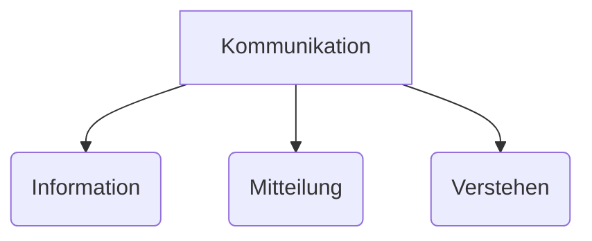
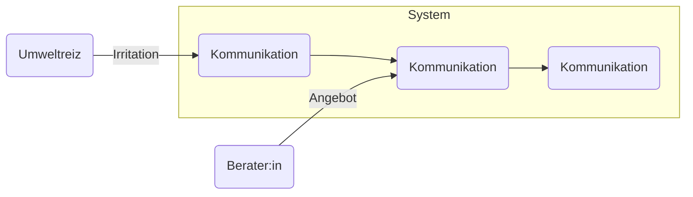

## 1. Was ist laut Luhmann Kommunikation?

Luhmann definiert Kommunikation als die Einheit von drei selektiven Komponenten:

- **Information** – Was wird gesagt?
- **Mitteilung** – Wie wird es gesagt?
- **Verstehen** – Wird es als Kommunikation erkannt?

**Wichtig:** Nur wenn alle drei Komponenten zusammenwirken, entsteht Kommunikation im systemtheoretischen Sinn.

### Mermaid-Diagramm: Drei Komponenten der Kommunikation

---

## 2. Operative Geschlossenheit und strukturelle Offenheit

- **Operative Geschlossenheit** bedeutet, dass ein System nur mit eigenen Operationen (z. B. Kommunikation) arbeitet.
- **Strukturelle Offenheit** bedeutet, dass das System Reize aus der Umwelt wahrnimmt, aber selbst entscheidet, ob und wie es darauf reagiert.

**Zusammen ermöglichen beide Prinzipien die Autonomie und Lernfähigkeit von Systemen.**

### Mermaid-Diagramm: Systemgrenze und Umwelt
