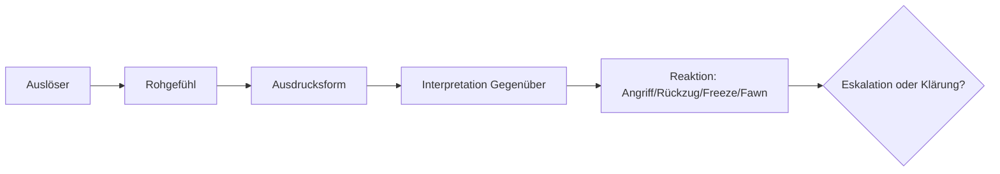

# Emotion – Bedürfnis – Interesse – Position  
### Ein integratives Modell für Mediation, Coaching und Organisationsberatung

Diese Notiz fasst die theoretisch und praktisch verfeinerte Unterscheidung zwischen **Emotionen**, **Bedürfnissen**, **Interessen** und **Positionen** zusammen – kompatibel mit Harvard-Konzept, Gewaltfreier Kommunikation (GFK), Transaktionsanalyse (TA) und systemischer Beratung.

---

## 1. Grundlogik des Modells

Konfliktverhalten entsteht typischerweise entlang folgender Kette:

**Auslöser → Rohgefühl → Ausdrucksform → Interpretation → Reaktion → Eskalation/Stabilisierung**

Dabei werden Bedürfnisse selten direkt kommuniziert. Stattdessen erscheinen:

- **Emotionen** als sichtbare Signale,
- **Interessen** als kontextspezifische Ableitungen,
- **Positionen** als verfestigte Lösungsvorschläge.

Das Modell hilft, diese Ebenen klar zu trennen und professionell zu bearbeiten.

---

# 2. Bedürfnisse (GFK, TA)
**Definition:**  
Stabile, universelle, nicht verhandelbare menschliche Grundbedürfnisse (Autonomie, Einfluss, Verbindung, Sicherheit, Sinn, Integrität etc.).

**Merkmale:**
- biologisch, psychologisch und sozial grundlegend  
- oft unbewusst oder sprachlich schwer zugänglich  
- in vielen Systemen tabuisiert oder moralisch bewertet  
- direkte Äußerung kann Scham, Verletzlichkeit oder Risiko erzeugen  

**Relevanz für die Praxis:**  
Bedürfnisse sind die tiefste Ebene eines Konflikts.  
Wenn sie sicher benennbar werden, entsteht Klärbarkeit.

---

# 3. Interessen (Harvard-Konzept)
**Definition:**  
Kontextspezifische, handlungsnahe Ausprägungen eines Bedürfnisses.

**Formel:**  
> Bedürfnis + Kontext + Ziel → Interesse

**Beispiel:**  
Bedürfnis: Sicherheit → Interesse: „Ich möchte frühzeitig über Änderungen informiert werden.“

**Merkmale:**
- verhandelbar  
- erklärbar  
- nicht so verletzlich wie Bedürfnisse  
- häufig in Mediation und Verhandlungen die produktivste Ebene  

**Praxisnutzen:**  
Interessen bilden die Brücke zwischen Mensch (Bedürfnis) und Sache (Lösung).

---

# 4. Positionen (Harvard-Konzept)
**Definition:**  
Konkrete, oft starre Lösungsvorschläge („Ich will, dass…“).

**Merkmale:**
- dienen häufig als Schutzstrategie  
- verdecken Interessen  
- werden in Organisationen belohnt („Durchsetzung“)  
- wirken konfliktverschärfend, wenn sie verabsolutiert werden  

**Praxisnutzen:**  
Positionen sind der Einstiegspunkt – aber **nie** das eigentliche Problem.

---

# 5. Emotionen (GFK, TA, Neurobiologie)
**Definition:**  
Primäre biologische Signale, dass etwas Wichtiges berührt ist.

**Vier Ebenen:**
1. **Rohgefühle** (biologisch, unmittelbar)
2. **Ausdrucksform** (sprachlich, nonverbal)
3. **Interpretation** durch das Gegenüber
4. **Reaktion** (Angriff, Rückzug, Erstarren, Beschwichtigen)

**Wichtig:**  
Emotionen zeigen an, **dass** ein Bedürfnis/Interesse berührt ist –  
aber nicht automatisch **welches**.

---

# 6. Warum Bedürfnisse selten direkt geäußert werden
**a) Psychologische Gründe:**
- Scham  
- Angst vor Zurückweisung  
- mangelnde Sprache/Klarheit  
- Ersatzgefühle (TA)

**b) Soziale und kulturelle Gründe:**
- Tabuisierung bestimmter Bedürfnisse (z. B. Nähe, Einfluss)  
- Normen („Professionelle haben keine Bedürfnisse“)  
- Rollenbilder (Führung, Elternschaft, Teamkultur)

**c) Organisationale Gründe (systemtheoretisch):**
- Organisationen kommunizieren über **Entscheidungen**, nicht über Bedürfnisse  
- Bedürfnissprache ist systemfremd  
- Interessen/Positionen sind anschlussfähig, Gefühle/Bedürfnisse nicht

**Konsequenz:**  
„Emotion statt Bedürfnis“ ist sowohl frühkindlich gelernt (TA)  
als auch systemisch stabilisiert.

---

# 7. Die Konfliktschleife im Überblick

**Wichtig:**  
Die Eskalation entsteht meistens **nicht** durch das Rohgefühl,  
sondern durch _Ausdruck + Interpretation_.

---

# 8. Professionelle Kernkompetenzen (Mediator, Coach, Organisationsberater)

### 8.1 Trennen & Übersetzen

- Emotion → Gefühl
    
- Gefühl → Bedürfnis
    
- Bedürfnis → Interesse
    
- Interesse → Optionen
    

### 8.2 Räume für sichere Sprachfähigkeit schaffen

- Entschleunigen
    
- Validieren
    
- Spiegeln
    
- Entmoralisieren
    
- Kontext klären
    

### 8.3 Systemische Perspektive einbeziehen

- Welche Strukturen verhindern Bedürfnissprache?
    
- Welche Rollen oder Machtverhältnisse beeinflussen die Dynamik?
    
- Welche Kommunikationsregeln/tabus gehören zum System?
    

### 8.4 TA-Perspektive würdigen

- Muster als **frühere Überlebensleistung** anerkennen
    
- heute auf Funktionalität prüfen
    
- Alternativen entwickeln
    

---

# 9. Die Essenz des Modells (Kurzfassung)

- **Bedürfnisse** sind universell, stabil und verletzlich.
    
- **Interessen** sind konkrete, verhandelbare Ausprägungen von Bedürfnissen.
    
- **Positionen** sind Schutzstrategien und verdecken Interessen.
    
- **Emotionen** signalisieren Relevanz, aber sind kein Ersatz für Klarheit.
    
- **Direkte Bedürfnissprache ist riskant** – psychologisch, sozial und organisational.
    
- **„Emotion statt Bedürfnis“ ist sowohl biografisch gelernt als auch systemisch stabilisiert.**
    
- Mediation/Coaching schaffen die Bedingungen, damit Bedürfnisse wieder sichtbar und Interessen verhandelbar werden.
    

---

# 10. Anwendung in deiner Praxis (Sweti)

- in Mediation: Übersetzen von Emotion → Bedürfnis → Interesse
    
- in Coaching: Beziehungssicherheit + Bewusstheit für Muster
    
- in Organisationsberatung: Tabus, Strukturen & Rollen sichtbar machen
    
- im Konfliktcoaching: Prozessklarheit statt Problemlösung
    
- im Leadership-Coaching: Bedürfnisse enttabuisieren, Interessen klären
    

---

# 11. Weiterführende Notizen

- [[Harvard-Konzept – Interessenanalyse]]
    
- [[GFK – Bedürfnisse & Gefühle]]
    
- [[TA – Ersatzgefühle & Skriptmuster]]
    
- [[Systemische Schleife – O-M-H-I-W]]
    
- [[Mediation – Struktur & Haltung]]